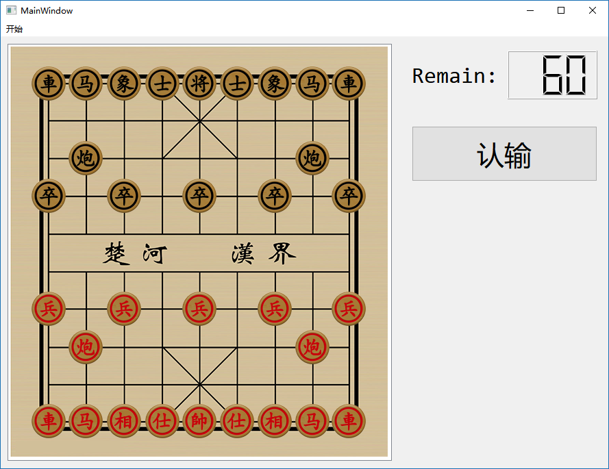

# QtXiangqi
📚 本次作业实现了一个象棋对战系统，支持联机对战，支持残局导入。



##  设计逻辑

在游戏开始前，程序为 S/C 关系，Server 建立游戏并等待连接，Client 通过手动输入 IP 和 端口号连接 Server，Socket 建立后 Server 将棋盘信息发送给 Client。

棋盘由 Server 决定，Server 可以导入残局文件修改初始棋盘。

接着游戏开始，此时程序为对称关系，原先 Server 的一端为红方，另一端为黑方，红方先行。

当胜负已定时，弹出弹窗显示胜者，并关闭程序。

## 代码设计

代码主要分成 MainWindow ServerDialog ClientDialog PIC Chess Select 这几个 Class

### ServerDialog

ServerDialog 负责连接阶段时 Server 端的操作。

使用 `<QNetworkInterface>` 内的 `QNetworkInterface::allAddresses()` 加载全部 IP 地址，并在其中筛选出可被连接的 IP 地址，并显示到界面上。

使用 `<QTcpServer>` 监听某个端口，并在建立连接的时候返回 `nextPendingConnection()` 到 `MainWindow`。

### ClientDialog

ClientDialog 负责连接阶段时 Client 端的操作。

使用 `<QRegExpValidator>` 限制 IP 的非法操作。

使用 `<QTcpSocket>` 连接 Server。

### PIC

自定义 `QGraphicsPixmapItem` 并重载 `mousePressEvent(QGraphicsSceneMouseEvent *event)` 使得能够接收到图片的鼠标点击操作。

### Chess

棋子的实现，类内包含棋子在棋盘的坐标、实际绘图坐标、红黑方、是否存活等有关棋子的信息。

棋子的 ID Range 和 Type 定义如下：

| 棋类 | ID Range | Type |
| ---- | -------- | ---- |
| 帅   | 0        | 0    |
| 兵   | 1-5      | 1    |
| 炮   | 6,7      | 6    |
| 车   | 8,9      | 8    |
| 马   | 10,11    | 10   |
| 象   | 12,13    | 12   |
| 士   | 14,15    | 14   |

图片为 PIC 类，通过 `setVisible` 控制棋子的显示与否。

### Select

选取框的实现。

图片为 PIC 类，通过 `setVisible` 控制棋子的显示与否，通过 `setShapeMode(QGraphicsPixmapItem::BoundingRectShape)` 使得透明元素也能接受鼠标点击事件。

### MainWindow

主程序的实现。

Socket 之间的信息传递使用 JSON 格式。

```C++
class MainWindow : public QMainWindow
{
    Q_OBJECT

public:
    explicit MainWindow(QWidget *parent = 0);
    ~MainWindow();

private slots:
	void acceptConnection(QTcpSocket*); // 若 Client 连接则将棋盘全局传输给 Client 并开始游戏
    void on_actionCreate_triggered(); // 触发「创建游戏」
    void on_actionConnect_triggered(); // 触发「连接游戏」
    void on_actionImport_triggered(); // 触发「残局导入」
    void on_actionSave_triggered(); // 触发「残局保存」
    void recvMessage(); // 当 Socket 接收到信息时触发
    void timeSlot(); // 定时器定时结束时触发
    void chessPress(int); // 当本方棋子被鼠标点击的时候（确定行棋的棋子），调用 holdChess
    void selectPress(int, int); // 当选择框被鼠标点击的时候（确定棋子的落处），移动棋子并将信息返回给对手，结束本方回合
    void on_pushButton_clicked(); // 触发「认输」

private:
    Ui::MainWindow *ui;
    QTcpServer *listenSocket;
    QTcpSocket *readWriteSocket;
    QImage *bg; // 载入图片
    QGraphicsScene *scene; // 绘制棋盘、棋子、选择框
    QTimer *msTimer; // 定时
    QMediaPlayer *qtaudioPlayer; // 播放音频

    bool isServer = true; // 记录当前是否为 Server 端，默认 Server 端为红方且先手
    Chess *redChess[16], *blackChess[16]; // 储存棋子，下标即为 ID

    void gameInit(); // 棋盘、棋子初始化，在构造函数内被调用
    void GAMEOVER(bool win, int type); // 游戏结束时调用

    void sendJSON(QJsonObject json); // 发送 JSON 信息
    void readJSON(QByteArray byteArray); // 接受 JSON 信息并读取，按信息种类分类处理

    void sendGame(); // 将棋盘全局以 JSON 格式发送
    void sendStep(int id, int x, int y); // 将行棋以 JSON 格式发送
    void sendOver(int type); // 将游戏结束信号以 JSON 格式发送

    bool isYourTurn = false; // 这是否是你的回合？
    void YourTurn(); // 轮到你的回合了
    void NotYourTurn(); // 轮到别人的回合了

    int countdown = 60;
    void startCountdown(int st_time);
    void setTime(int countdown);

    bool gameStart = false;

    Chess *pressedChess = NULL; // 行棋的棋子
    void holdChess(); // 将棋子当前位置和其能到达的位置用选择框标记
    void releaseChess(); // 清除 holdChess 所带来的效果

    void killChess(int x, int y); // 吃掉某个位置上的棋子（假如有的话）
    void moveChess(Chess *c, int x, int y); // 移动某个棋子到 (x,y)
    int posChess(int x, int y); // 判断 (x,y) 上是否有棋子，返回 ID，<0 为敌方，>0 为本方

    bool checkPos(int x, int y); // 判断 (x,y) 合不合法

    Select *selectMap[9][10]; // 给每个位置都新建一个选择框，初始化为不可见
    void select(int x, int y, bool sensetive); // (x,y) 的选择框高亮显示，并设置是否接受鼠标点击信号
    void selectClear(); // 清楚屏幕上的所有选择框

    bool canAttack(Chess *now, int aim); // 判断某个棋子是否能攻击到对方的帅
    bool Check(); // 判断是否将军

    void chessImport(QString str, Chess **arr, int st); // 读取一行文本以获得某一方某一类的棋子信息（残局格式）
    QString chessSave(Chess **arr, int st, int ed); // 将某一方某一类的棋子信息集合成一行（残局格式）
};
```

## 编写环境

IDE：Qt 5.4.4, SublimeText

System：Windows 10

## Github

Github 上提供 releases 版本。

https://github.com/Konano/QtXiangqi